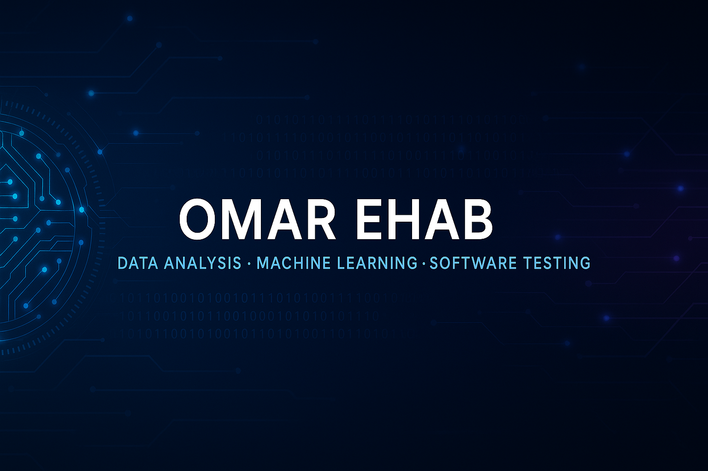

# AI & Data Science Portfolio

 
  
  

---

## 📌 Table of Contents
- [About Me](#about-me)
- [Projects](#projects)
- [Skills](#skills)
- [Tools](#tools)
- [Courses](#courses)
- [Resources & Contributions](#resources--contributions)
- [Contact](#contact)

## 👨‍💻 About Me

I am an **AI Developer** with a strong background in **Data Analysis and Machine Learning**. My expertise includes analyzing large datasets, building predictive models, and deploying AI-driven solutions. I am passionate about leveraging AI to solve real-world problems and continuously expanding my knowledge in the field.

## 🚀 Projects

### 1. Data Analysis & Visualization
- **[Titanic Dataset Analysis](https://github.com/omarehab15/AI-Data_Science/tree/main/Tasks/Titanic%20Dataset%20Analysis)** – Performed data cleaning, data visualization, and built a dashboard for the Titanic dataset from Kaggle.
- **[Sales Data Analysis](https://github.com/omarehab15/AI-Data_Science/tree/main/Tasks/Sales%20Data%20Analysis)** – Conducted data cleaning, analysis, and visualization for random sales-related data.
- **[E-commerce Dataset Analysis](https://github.com/omarehab15/AI-Data_Science/tree/main/Tasks/E-commerce_Dataset_Analysis)** – Performed data cleaning, analysis, and visualization for an e-commerce dataset from Kaggle.

### 2. Web Scraping
- **[Bookstore Data Scraping](https://github.com/omarehab15/AI-Data_Science/tree/main/Tasks/WebScrabing_project)** – Scraped book sales data from an online bookstore, performed data cleaning, analysis, and visualization.

### 3. Machine Learning & AI

## 🛠 Skills

- **Programming:** Python  
- **Web Scraping:** Requests, BeautifulSoup, Selenium  
- **Databases:** SQL, MySQL  
- **Data Analysis:** Pandas, NumPy, Statistics  
- **Data Visualization:** Matplotlib, Dash, Streamlit, Seaborn, WordCloud, PyWaffle, Folium, JSON, Geopy  
- **Version Control:** Git & GitHub  

## 🛠 Tools

- **Data Science & AI:** Jupyter Notebook  
- **Databases:** MySQL, PostgreSQL  

## 📚 Courses

- **Data Science & Machine Learning** – Hands-on projects covering EDA, feature engineering, and model evaluation.  
- **SQL for Data Analysis** – Writing complex SQL queries for data extraction and transformation.  

## 🌟 Resources & Contributions

- **[GitHub Repositories](https://github.com/omarehab15/AI-Data_Science.git)** – Open-source projects and data science implementations.  

## 📞 Contact

- **LinkedIn:** [Omar Ehab Eid](https://www.linkedin.com/in/omar-ehab-eid)  
- **Email:** ehab63047@gmail.com  
- **Portfolio:** [Omar Ehab Elsayed](https://furtive-yew-8c5.notion.site/Omar-Ehab-Elsayed-17dfc1df2f3780eb9bd4cdca4003fca8?pvs=4)  

---

_📌 Feel free to explore my projects and reach out for collaboration! 🚀_

